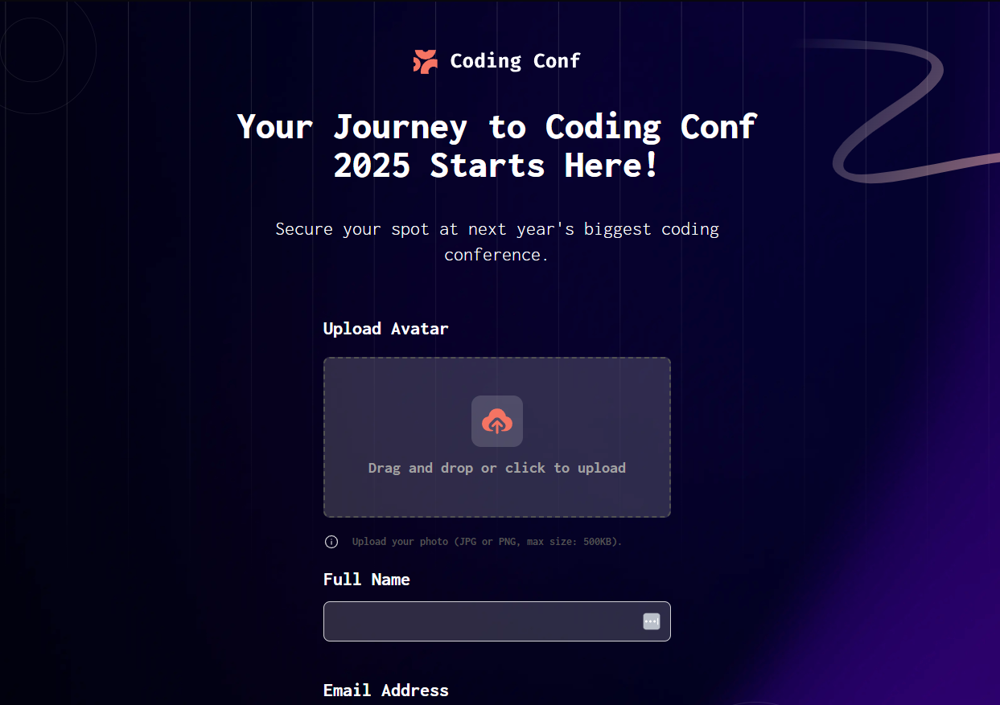

# Frontend Mentor - Conference ticket generator solution

This is a solution to the [Conference ticket generator challenge on Frontend Mentor](https://www.frontendmentor.io/challenges/conference-ticket-generator-oq5gFIU12w). Frontend Mentor challenges help you improve your coding skills by building realistic projects. 

## Table of contents

- [Overview](#overview)
  - [The challenge](#the-challenge)
  - [Screenshot](#screenshot)
  - [Links](#links)
- [My process](#my-process)
  - [Built with](#built-with)
  - [What I learned](#what-i-learned)
  - [Continued development](#continued-development)
  - [Useful resources](#useful-resources)
- [Author](#author)

## Overview

### The challenge

Users should be able to:

- Complete the form with their details
- Receive form validation messages if:
  - Any field is missed
  - The email address is not formatted correctly
  - The avatar upload is too big or the wrong image format
- Complete the form only using their keyboard
- Have inputs, form field hints, and error messages announced on their screen reader
- See the generated conference ticket when they successfully submit the form
- View the optimal layout for the interface depending on their device's screen size
- See hover and focus states for all interactive elements on the page

### Screenshot

### Links

- Solution URL: [localhost:5173](http://localhost:5173)
- Live Site URL: [confrerece-ticket-challenge.netlify.app](https://confrerece-ticket-challenge.netlify.app)

## My process

### Built with

- Semantic HTML5 markup
- CSS custom properties
- Flexbox
- CSS Grid
- Mobile-first workflow
- [React](https://reactjs.org/) - JS library
- [Tailwind CSS](https://tailwindcss.com) - For styles

### What I learned

This was my first project to submit to Frontend mentor and to practice some React with conjunction with tailwind since i recently learned how to use it and i wanted to see how useful the tool was and i had to admit that is a powerful tool

Also went for a little self challenge to not use any external UI Library and to create my own component library for this specific project

The element that cost me more to develop was the drag and drop element, since i am used to just import an drag an drop from an UI library and to learn how the Drag and drop API works in html was a challenge in this project. In the end with the help in the [MDN Documentation](https://developer.mozilla.org/en-US/) and using Copilot and DeepSeek to understand how to implement this function i managed to go, for what i think, a satisfactory result

### Continued development

Some things I want to improve an get better on are the code legibility and mantenability i understand i could decouple some functions or elements in the `InputDragAndDrop.jsx` and specially in the `Form.jsx`.

Also i want to start getting the habit of doing the test cases first and implementing automatic tests to assure the QA of the page, since i been having bugs almost every time i started to develop a new feature.

### Useful resources

- [MDN Documentation](https://developer.mozilla.org/en-US/) - Really useful doc to discover new functions and to understand other API's that could help in web development
- [Example resource 2](https://www.example.com) - This is an amazing article which helped me finally understand XYZ. I'd recommend it to anyone still learning this concept.

## Author

- Website - [Diego Quiñones](https://diegoqr-portfolio.dev)
- Frontend Mentor - [@DiegoQR](https://www.frontendmentor.io/profile/DiegoQR)
- Linkedin - [Diego Quiñones](https://www.linkedin.com/in/diego-alejandro-quinones-rudon)

